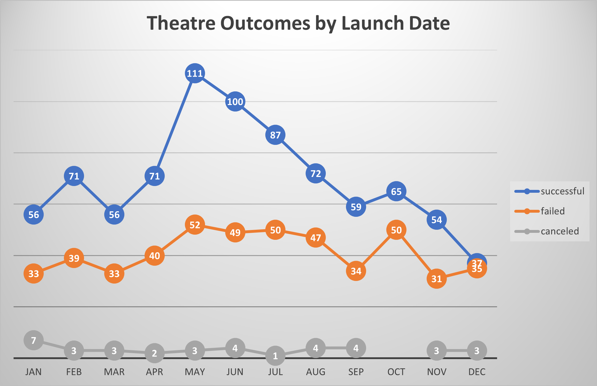
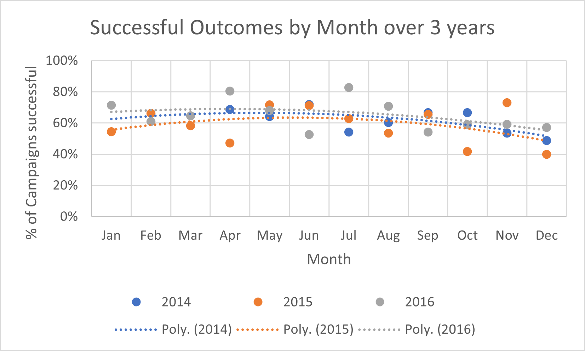
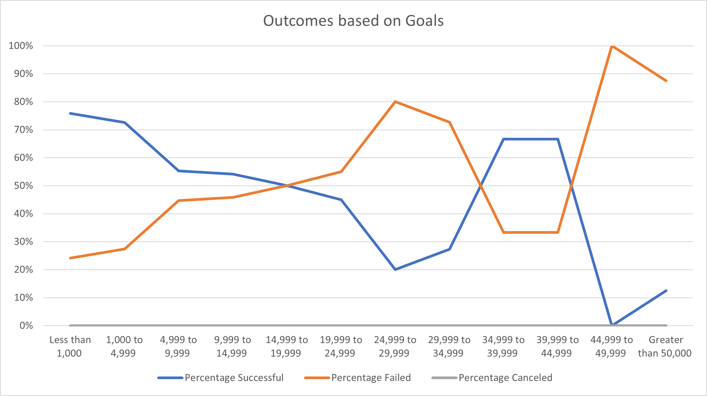

# kickstarter-analysis

## Project Overview
    The goal of this project is to analyze kickstarter campaign data to determine
    the impact of the following two variables on campaign success:
    - Launch Date
    - Funding goal (in local currency)
    
---
## Analysis and Challenges
### Analysis of Outcomes by Launch Date
    First we segment the data by launch date, using the date the campaign was created. This was done in Excel 
    using a pivot table, with Parent category to filter for Theatre only. The conveted date created column 
    was used as rows (specifically Month of the year (mmm)), while outcome was used as both the column header 
    and the value to be counted.
    
    Chart 1:

###
    Though we have data points from 2009 to 2017, 2017 is incomplete, data prior to 2014 is very thin,
    and several years lack results results for each month. We only have 2 years with campaigns in every
    month (2015, 2016). A second view, based on launch month and year was also created, to provide a 
    more granular picture of success by month. A second pivot table was created to build this chart, 
    with years and outcomes as rows, while date created was added for column headers. Outcomes remained 
    as the value to be counted, though the display of the count was changed to show as % of row total. 
    Note that this table only includes success and failure in computing % of total.
    
    Chart 2:

    
### Analysis of Outcomes by Funding Goal
    Segmenting data by funding goal was done by breaking goals down into $5K increments, with a minimum of 
    $1K. Note all analysis is done in local currency, so we've blended amounts in different currencies. 
    
    Chart 3:

### Challenges and Difficulties Encountered
Creating the Seasonality table with a pivot table was challenging because using % of row total is dynamic.  
When you wish to remove categories from being displayed, they are similarly removed from the calculation 
(hence if I only wanted to display successful outcomes, % of row total would show 100% for all non-zero 
values).  To work around that challenge, I copied the relevant data out of the pivot table.

## Results
May is to be the optimal month to launch a campaign. As seen in Chart 1 and 2, May tends to have both the 
highest number of campaign launches and the highest level of success.
Generally speaking, proability of success tends to be above 50%, except for the month of December. As noted, 
success is most likely in May, and gradually declines through to December.  This also coincides with the 
number of campaigns launched, where December has the lowest number of campaigns launched. Examining the 
relationship between # of campaigns launched and probability of success is an avenue for further research.

By goal size, there is a roughly inverse relationship between goal size and success. The larger the goal, 
the lower the liklihood of success.  The relatively high success of plays in the $35-$45K range breaks this 
trend, as seen in Chart 2, but it is othewise well borne out in the data.   Segmenting the data by 
currency/country/content (subject matter of play) would be worthy of further investigation to more fully 
understand the relationship here.

The dataset itself is somewhat limited, as mentioned above, due to a lack of results in all years for all 
months. Extending the horizon for analyis (i.e. adding more years as they become available) may help with 
this limitation. More detail on the name recognition of actors or others involved with the shows could 
also be useful for understanding the liklihood of success.

